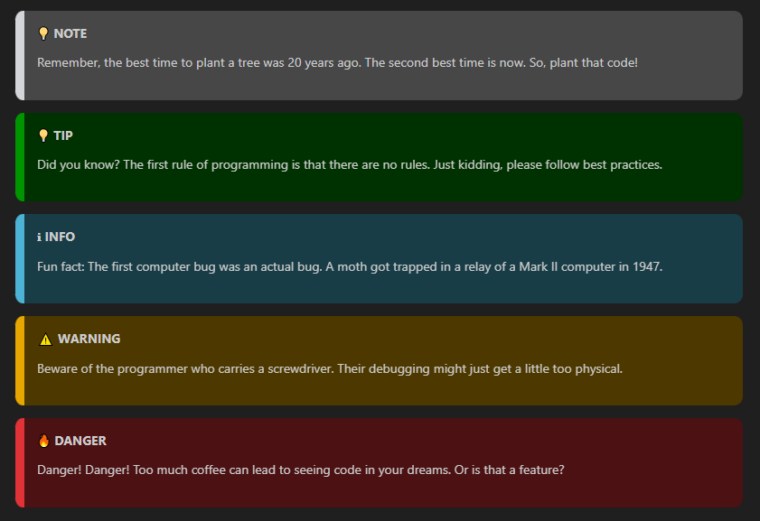

# Markdown Admonitions

Enables Docusaurus-style admonitions in the VS Code preview.

## Features

Several static site generators for documentation including Docusaurus have support for informational hints in the documentation. This extension allows for the preview to show the Docusaurus style admonitions.

An example is 

```
:::note
Remember, the best time to plant a tree was 20 years ago.
The second best time is now. So, plant that code!
:::
```

This and the other divs will be displayed like this in dark mode in VS Code:




The markdown for the four divs will be shown like above if the extension is enabled. Otherwise they will be four paragraphs of text.

:::note
Remember, the best time to plant a tree was 20 years ago. The second best time is now. So, plant that code!
:::

:::tip
Did you know? The first rule of programming is that there are no rules. Just kidding, please follow best practices.
:::

:::info
Fun fact: The first computer bug was an actual bug. A moth got trapped in a relay of a Mark II computer in 1947.
:::

:::warning
Beware of the programmer who carries a screwdriver. Their debugging might just get a little too physical.
:::

:::danger
Danger! Danger! Too much coffee can lead to seeing code in your dreams. Or is that a feature?
:::

Additional info at [Docusaurus](https://docusaurus.io/docs/markdown-features/admonitions).

Based on [markdown-it](https://github.com/markdown-it/markdown-it) and [markdown-it-container](https://github.com/markdown-it/markdown-it-container).

## Requirements

Runs in Visual Studio Code.

## Extension Settings

This extension contributes the following settings:

* `markdownAdmonitions.enable`: Enable/disable this extension.

## Known Issues

None.

## Release Notes

### 0.0.2

Switched to markdown-it-container from markdown-it-fence
