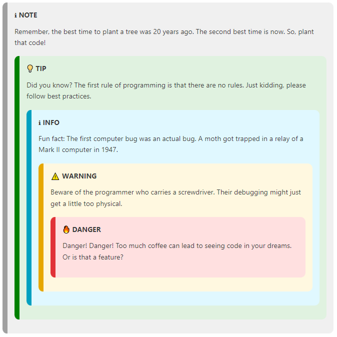

# Markdown Admonitions

[](https://pokerhandboken.visualstudio.com/github-builder/_build/latest?definitionId=1&branchName=main)
[](https://marketplace.visualstudio.com/items?itemName=TomasDahlqvist.markdown-admonitions)

Enables Docusaurus-style and MkDocs-style admonitions in the VS Code preview.

## Features

Several static site generators for documentation including Docusaurus have support for informational hints in the documentation. This extension allows for the preview to show Docusaurus and MkDocs admonitions. MkDocs style admonitions fall back to a default and docusaurus style only renders known types.

Examples:

```docusaurus
:::note
Remember, the best time to plant a tree was 20 years ago.
The second best time is now. So, plant that code!
:::
```

```MkDocs
!!! note
    *here be dragons*

??? note
    This is hidden unless expanded.
```

This and the other divs will be displayed like this in dark mode in VS Code:


They can also be stacked:



The markdown for the four divs will be shown like above if the extension is enabled. Otherwise they will be four paragraphs of text.

Additional info at [Docusaurus](https://docusaurus.io/docs/markdown-features/admonitions).

Based on [markdown-it](https://github.com/markdown-it/markdown-it), [markdown-it-container](https://github.com/markdown-it/markdown-it-container) and [markdown-it-admon](https://github.com/commenthol/markdown-it-admon).

## Requirements

Runs in Visual Studio Code.

## Extension Settings

This extension contributes the following settings:

* `markdownAdmonitions.enable`: Enable/disable this extension.

## Known Issues

None.
